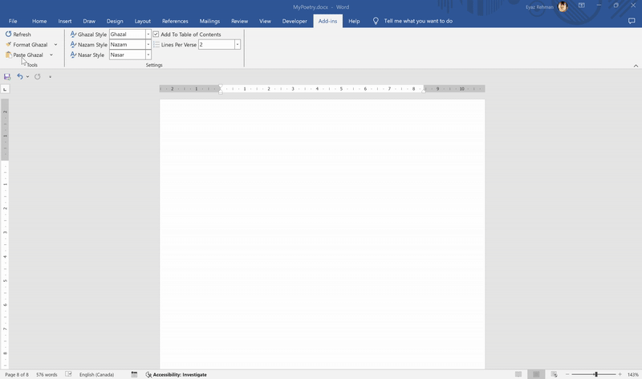

# Urdu Language Tools for Microsoft Word

This project is a VSTO (Visual Studio Tools for Office) plugin for Microsoft Word that provides tools for formatting Urdu poetry, including Ghazals, Nazams, and Nasars.

## Features

- Format Ghazals with specific styles and lines per verse.
- Add formatted Ghazals to the table of contents.
- Remove multiple spaces from selected text.
- Paste and format Ghazal text from the clipboard.




## Installing the Plugin

To install the plugin, follow these steps:

1. Copy or download the published files.

2. Install the certificate by double-clicking on the `CodeSigningCert.cer` file and following the installation wizard. The certificate is not password-protected. The certificate must be installed in the `Trusted Root Certification Authorities` store.

3. Run the `setup.exe` file to install the plugin.

## Building the Project

To build the project, follow these steps:

1. Clone the repository:
    ```sh
    git clone https://github.com/imposter/urdu-language-tools.git
    cd UrduLanguageTools
    ```

2. Open the solution file `UrduLanguageTools.sln` in Visual Studio.

3. Right-click on the project `UrduLanguageTools` and select `Properties`.

4. Go to the `Signing` tab and check the box `Sign the ClickOnce manifests`.

5. Click on the `Select from file...` button and select the provided developer code signing certificate PFX file located at `UrduLanguageTools/UrduLanguageTools_DeveloperKey.pfx`. The certificate is not password-protected.

The plugin will be built for local development.

## License

This project is licensed under the MIT License. See the `LICENSE` file for more details.